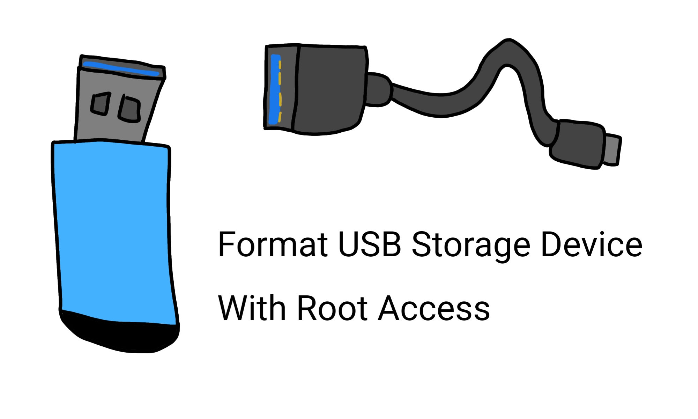

# Come formattare un dispositivo di archiviazione USB in Termux con accesso root

<p align="center">
  
</p>

## Prima di procedere!!!

- **NON SONO RESPONSABILE PER EVENTUALI DANNI CHE POTRESTI CAUSARE SE SEGUI QUESTI PASSAGGI IN MODO ERRATO**!!!
- Assicurati di leggere questa guida almeno una volta prima di procedere, sei stato avvisato.
- Assicurati di avere [Magisk](https://github.com/topjohnwu/Magisk), [Apatch](https://github.com/bmax121/APatch) o [KernelSU](https://github.com/tiann/KernelSU) installato sul tuo dispositivo.
- Assicurati di avere installato sudo o tsu eseguendo uno dei seguenti comandi:

```bash
pkg update && pkg upgrade -y && pkg install sudo
```
 * Oppure:
```bash
pkg update && pkg upgrade -y && pkg install tsu
```
 * **ATTENZIONE**: non puoi avere sia sudo che tsu installati contemporaneamente. Se hai già installato sudo, l'installazione di tsu fallirà e viceversa.
## Aggiornare e installare i binari
 * Aggiorna i binari di termux e installa blk-utils e dosfstools:
 * **NOTA**: dosfstools è necessario per formattare le unità come FAT32. Se non ti serve non installarlo, ma è utile averlo a portata di mano. Android standard dovrebbe già includere (mkfs.erofs, mkfs.exfat, mkfs.ext2, mkfs.ext3, mkfs.ext4, mkfs.ntfs).
```bash
pkg update && pkg upgrade -y && pkg install blk-utils dosfstools -y
```
## Trovare e identificare il dispositivo di archiviazione USB
 * Trova il percorso del dispositivo di archiviazione USB usando lsblk da blk-utils:
```bash
sudo lsblk
```
 * Esempio di output:
```bash
sdf       8:80   1  3.7G  0 disk
└─sdf1    8:81   1  3.7G  0 part /mnt/media_rw/0124-1790 <-- Prendi nota per dopo.
```
 * Nel mio caso è sdf1.
## Identificare l'ID del dispositivo di archiviazione USB e smontare
 * Identifica l'ID del dispositivo di archiviazione USB con sm e smontalo:
```bash
sudo sm list-volumes
```
 * Esempio di output:
```bash
public:8,81 mounted 0124-1790 <-- Lo stesso di lsblk.
private mounted null
emulated;0 mounted null
```
 * Nel mio caso l'ID è public:8,81.
```
sudo sm unmount public:8,81
```
 * Dopo questo passaggio, l'unità verrà smontata e potremo procedere con la formattazione.
## Formattare e rimontare il dispositivo di archiviazione USB
 * Formatta il dispositivo di archiviazione USB come preferisci con uno di questi: (mkfs.erofs, mkfs.exfat, mkfs.ext2, mkfs.ext3, mkfs.ext4, mkfs.ntfs).
 * Io userò mkfs.vfat da dosfstools.
```bash
sudo mkfs.vfat -F 32 -n MIAUNITA /dev/block/sdf1 <-- Modifica questo!!!
```
 * **NOTA**: cambia il percorso del blocco del tuo dispositivo di archiviazione USB con quello corrispondente al tuo. Nel mio caso è /dev/block/sdf1, inoltre i blocchi dei dispositivi di archiviazione su Android sono elencati sotto /dev/block e non /dev.
 * Esempio di output:
```bash
mkfs.fat 4.2 (2021-01-31)
```
 * Ora possiamo montare il dispositivo di archiviazione USB con sm.
```bash
sudo sm mount public:8,81
```
 * Oppure possiamo montarlo come memoria interna con:
```bash
sudo sm partition public:8,81 private
```
 * Non consigliato per dispositivi di archiviazione USB esterni.
 * Evviva! Ce l'hai fatta, hai completato la guida con successo!
